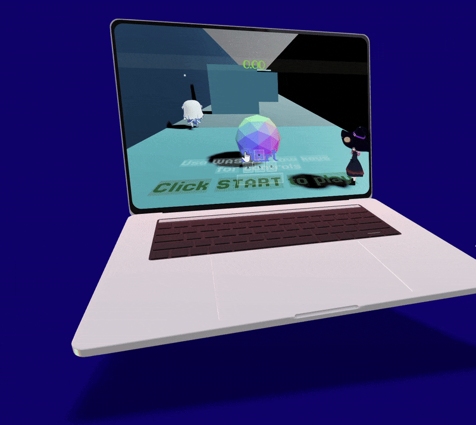
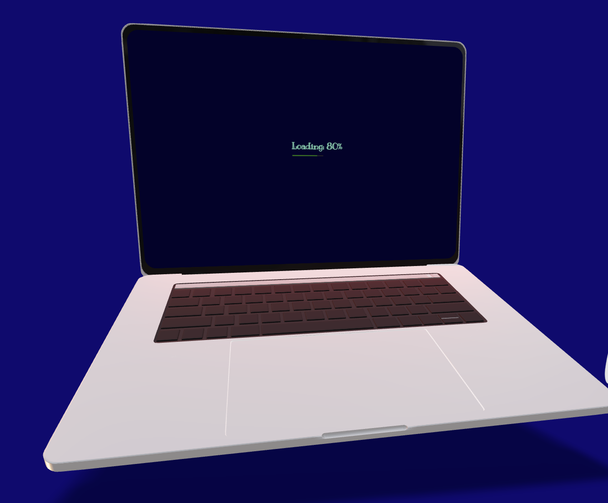
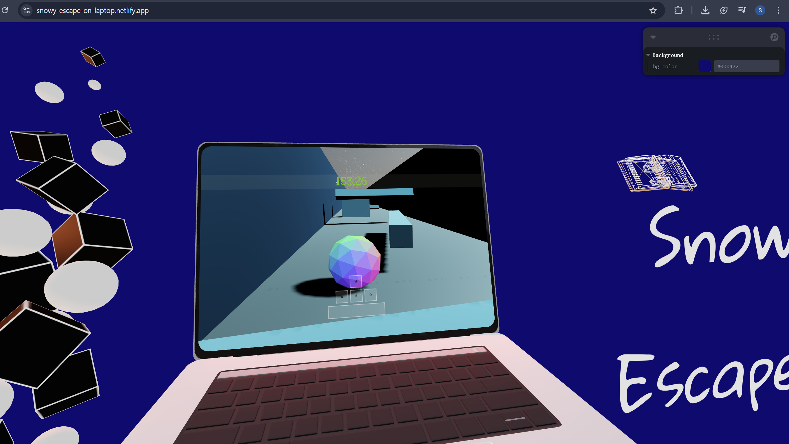

# 🖥️ 3D-within-3D

 <!-- Replace with an actual GIF or screenshot -->

> 🚀 A trippy 3D experience where a **3D game runs inside a 3D MacBook**, inside your real laptop screen.  
> Yes — it’s **a game within a 3D laptop**, being viewed on a real laptop.  
> That’s recursion for the frontend devs. 😉

---

### 🌐 **Play It Now**
🎮 [snowy-escape-on-laptop.netlify.app](https://snowy-escape-on-laptop.netlify.app)

---

## 🧠 The Concept
-It ain't that serious actually😓 I just used it to test stuff out and practice
- 📦 A 3D-modeled **MacBook** (using GLTF/Blender)
- 🕹️ A fully playable **3D game embedded inside its screen**
- 👀 A viewer’s paradox — you’re looking at a laptop inside your laptop inside a browser

> 🤯 You’re using a laptop to view a laptop that contains a game. *How deep does the rabbit hole go?*

---

## 🚀 Tech Stack

| Core | Animation | 
|------|-----------|

| `JavaScript` | `React Three Fiber` |


---

## 🎨 Features

- 💻 Interactive **3D MacBook model** as a scene wrapper
- 🧊 Embedded game from **Snowy Escape**
- 🌀 Smooth transitions and animations using Javascript + R3F
- 🎯 Click, rotate, and *go inside the laptop(zoom-in!)*


---

## 📸 Screenshots


### 🔁 The Inception Moment


### 📦 Gameplay view


---

## 📦 Installation (for local development)

```bash
git clone https://github.com/srijan123/3D-within-3D.git
cd 3D-within-3D
npm install
npm run dev
